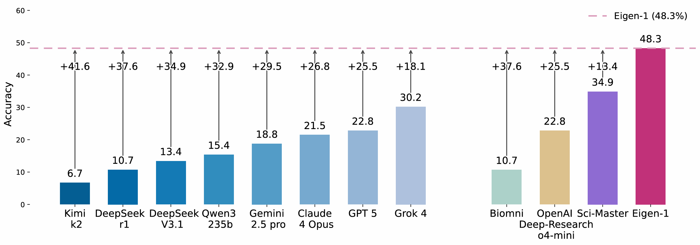
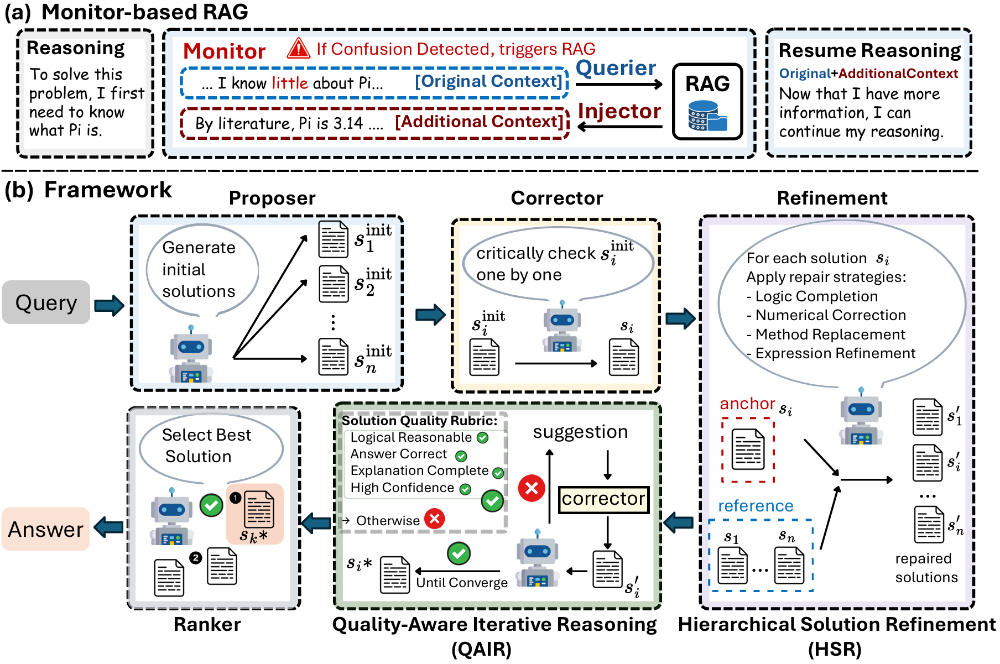

<div align="center">

# Eigen-1: Scientific Reasoning through Adaptive Multi-Agent Refinement and Monitor-based RAG


</div>

---




## Abstract

Large language models (LLMs) have recently shown strong progress on scientific reasoning, yet two major bottlenecks remain.
First, explicit retrieval fragments the reasoning process, imposing a hidden "tool tax" of extra tokens and steps.
Second, multi-agent pipelines often dilute strong solutions by averaging across all candidates.
We address these challenges with a unified framework that combines implicit retrieval and structured collaboration.
At its foundation, a Monitor-based retrieval module operates at the token level, seamlessly injecting external knowledge without interrupting reasoning.
On top of this substrate, Hierarchical Solution Refinement (HSR) iteratively designates each candidate as an anchor to be repaired by its peers, while Quality-Aware Iterative Reasoning (QAIR) adapts the refinement process to solution quality.
On Humanity’s Last Exam (HLE) Bio/Chem Gold, our framework achieves 48.3% accuracy—the highest reported to date—surpassing the strongest agent baseline by 13.4 points and leading frontier LLMs by up to 18.1 points, while simultaneously reducing token usage by 68.5% and reasoning steps by 53.5%.
Results on SuperGPQA and TRQA confirm robustness across domains.
Error analysis shows that reasoning failures and knowledge gaps co-occur in over 85% of cases, while diversity analysis reveals a clear dichotomy: retrieval tasks benefit from solution variety, whereas reasoning tasks favor consensus.
Case studies further demonstrate how implicit augmentation and structured refinement directly resolve the inefficiencies introduced by the tool tax.

---



## Method Overview

Automated construction of three-tiered benchmarks (Earth-Iron, Earth-Silver, Earth-Gold) from 100K papers, enabling comprehensive evaluation of knowledge coverage, professional proficiency, and scientific exploration capabilities.


---

## RAG Monitor

### Configure API key
```bash
export OPENAI_API_KEY="*****"
export OPENAI_BASE_URL="*****"
```

### Run RAG Monitor
```bash
cd code
python rag_monitor.py
```